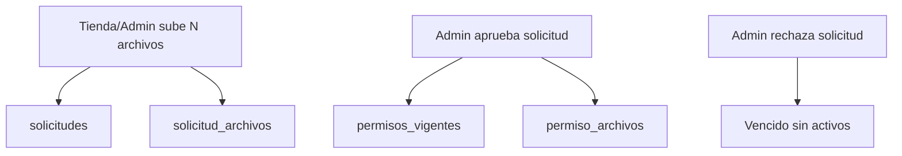

# Implementar Multi-Archivo por Permiso

## Enfoque recomendado

Usar un modelo padre-hijo para adjuntos, manteniendo compatibilidad con columnas legacy (`archivo_path`, `archivo_adjunto_path`) durante transición.

## Cambios de base de datos

- Crear tabla `solicitud_archivos`:
  - `id`, `id_solicitud`, `path`, `nombre_original`, `mime_type`, `tamano_bytes`, `created_at`.
- Crear tabla `permiso_archivos`:
  - `id`, `id_permiso_vigente`, `path`, `nombre_original`, `mime_type`, `tamano_bytes`, `origen` (`solicitud`/`directo`), `created_at`.
- Índices:
  - `solicitud_archivos(id_solicitud)`, `permiso_archivos(id_permiso_vigente)`.
- Mantener temporalmente:
  - `solicitudes.archivo_adjunto_path` y `permisos_vigentes.archivo_path` como fallback legacy.
- Reglas de borrado:
  - `ON DELETE CASCADE` desde solicitud/permiso padre hacia tablas de archivos.

## Backend/servicios en frontend (Supabase client)

- Extender `frontend/lib/storage.ts`:
  - `uploadFiles(...)` para múltiples archivos por solicitud/directo.
  - `deleteFiles(paths[])` para limpieza en lote.
- Convención de rutas:
  - solicitudes: `solicitudes/{id_tienda}/{id_solicitud}/{timestamp}_{safeName}`
  - activos: `activos/{id_tienda}/{id_permiso_vigente}/{timestamp}_{safeName}`
- Validaciones:
  - máximo archivos por operación (ej. 10)
  - tamaño por archivo y total
  - MIME permitidos

## Ajustes de flujo funcional

- En `frontend/hooks/useSolicitudes.ts`:
  - `crearSolicitud`: guardar solicitud + N registros en `solicitud_archivos`.
  - `aprobar`: mover/copiar N archivos de solicitud a activos y registrar en `permiso_archivos`; dejar estatus `Activo` (legacy `Aprobado` como lectura).
  - `rechazar`: estatus `Vencido`; no promover archivos a activos.
- En carga directa admin (`directorio/[id]`):
  - permitir N archivos y guardarlos directo en `permiso_archivos`.
- Limpieza por vencimiento:
  - al expirar permiso, borrar todos los paths de `permiso_archivos` + fallback legacy.

## Cambios de UI

- En `frontend/app/(dashboard)/directorio/[id]/page.tsx`:
  - input múltiple (`multiple`) + drag & drop múltiple.
  - listado previo de archivos seleccionados con opción de quitar antes de enviar.
  - en tablas de Vigentes/Vencidos/Solicitudes mostrar botón “Ver archivos (N)” y modal/lista de archivos.
- En hooks de detalle:
  - `frontend/hooks/useTiendaDetalle.ts`
  - `frontend/hooks/usePermisos.ts`
  - incluir joins a nuevas tablas y fallback legacy.
- Roles:
  - Tienda/Admin pueden subir
  - Admin/Tienda/Regional pueden visualizar

## Compatibilidad y migración de datos

- Fase 1 (híbrida): leer archivos desde nuevas tablas y, si no hay, desde columnas legacy.
- Script de migración opcional:
  - backfill de `archivo_adjunto_path` -> `solicitud_archivos`
  - backfill de `archivo_path` -> `permiso_archivos`
- Fase 2: cuando todo esté migrado, retirar dependencia de columnas legacy.

## Plan de pruebas (aceptación)

- Flujo Tienda:
  - subir 3 archivos a un permiso -> solicitud `Pendiente` -> admin visualiza 3.
- Flujo Admin aprobación:
  - aprobar solicitud con 3 archivos -> permiso `Activo` -> los 3 visibles para Admin/Tienda/Regional.
- Flujo Admin rechazo:
  - rechazar -> permiso `Vencido` -> sin activos publicados.
- Carga directa Admin:
  - subir 2+ archivos con fecha válida -> `Activo` y visibles para 3 roles.
- Vencimiento:
  - forzar fecha vencida -> mueve a vencido y elimina todos los activos del bucket.
- Legacy:
  - permiso viejo con `archivo_path` único sigue visible en “Ver archivos (1)”.
- Duplicados resilientes:
  - si hay varias filas históricas de `permisos_vigentes`, la UI no rompe y muestra adjuntos del registro vigente más reciente.

## Riesgos y controles

- Duplicados en `permisos_vigentes`: normalizar por `id_tienda + id_tipo_permiso` con índice único cuando sea posible.
- Costos de storage: limpieza en lote al expirar/borrar.
- UX con muchos archivos: paginar/limitar previsualización y mostrar contador.
